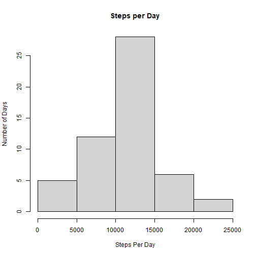
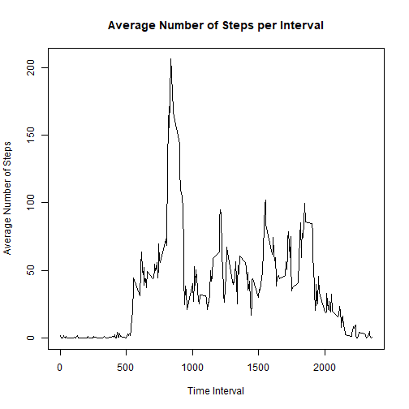
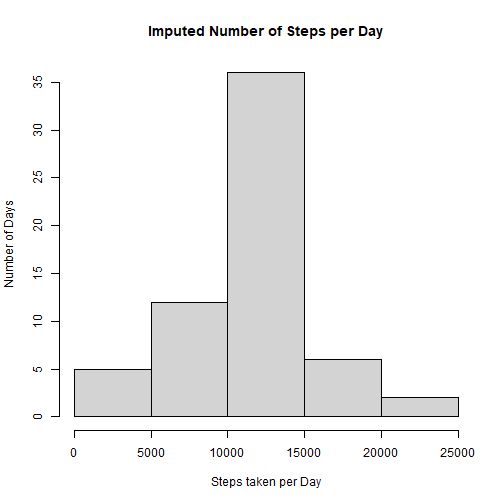
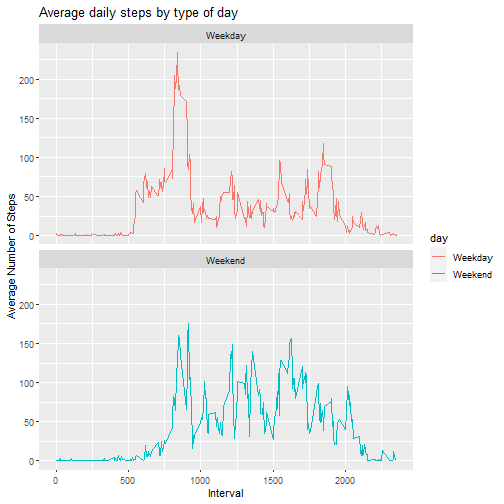

Activity Course Project
=======================

### Downloading and Processing the Data

```r
fileURL <- "https://d396qusza40orc.cloudfront.net/repdata%2Fdata%2Factivity.zip"
download.file(fileURL,"activity.zip",method="curl")
unzip("activity.zip")
activity <- read.csv("activity.csv")
activity$date <- as.Date(as.character(activity$date))
totals <- aggregate(steps~date,activity,sum,na.rm=TRUE)
```

### Data on Daily Steps

```r
hist(totals$steps,xlab="Steps Per Day",main="Steps per Day",ylab="Number of Days")
```




```r
mean_steps <- mean(totals$steps,na.rm=TRUE)
mean_steps
```

```
## [1] 10766.19
```


```r
median_steps <- median(totals$steps,na.rm=TRUE)
mean_steps
```

```
## [1] 10766.19
```
### Steps by Interval

```r
interval_totals<-aggregate(steps~interval,activity,mean,na.rm=TRUE)
with(interval_totals,plot(interval,steps,type="l",xlab="Time Interval",ylab="Average Number of Steps",main="Average Number of Steps per Interval"))
```




```r
max_interval <- interval_totals[which.max(interval_totals$steps),]$interval
max_interval
```

```
## [1] 835
```


### Missing Data

```r
num_missing <- sum(is.na(activity$steps))
num_missing
```

```
## [1] 2304
```

### Fill Missing Data by interval mean

```r
## Finds positions in interval_total where same as actitity the
##length of activity. Imput is then list length of activity, which values of 
##int_tot$step for for the positions in the vector created by match
imput <- interval_totals$steps[match(activity$interval,interval_totals$interval)]
imputed <- transform(activity, steps=ifelse(is.na(activity$steps),yes=imput,no=activity$steps))
imputed_daily <- aggregate(steps~date,imputed,sum)
```


```r
hist(imputed_daily$steps,xlab="Steps taken per Day",ylab="Number of Days",main="Imputed Number of Steps per Day")
```




```r
imput_mean <- mean(imputed_daily$steps)
imput_mean
```

```
## [1] 10766.19
```


```r
imput_median <- median(imputed_daily$steps)
imput_median
```

```
## [1] 10766.19
```
Median and mean are the same with or without the imputed data.  
### Weekend vs. Weekday

```r
activity$day <- sapply(activity$date,function(x){
  if (weekdays(x) == "Saturday"|weekdays(x)=="Sunday")
  {y <- "Weekend"} else
  {y<-"Weekday"}
  y
})
```


```r
daytype <- aggregate(steps~interval+day,activity,mean,na.rm=TRUE)
g <- ggplot(daytype,aes(x=interval,y=steps,color=day))+geom_line()+labs(title="Average daily steps by type of day",x="Interval",y="Average Number of Steps")+facet_wrap(~day,nrow=2)
print(g)
```


